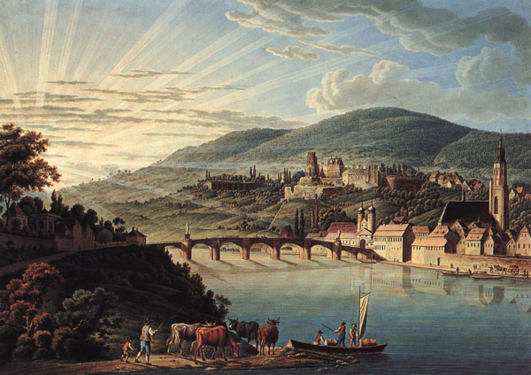

# Introduction

{:.float-right}

It is the year 852 as counted from the founding of the imperial city of Heliconium.  The city and the Helic empire collapsed hundreds of years ago, however, the Free City of Blackwater still thriving on the fringes of the old empire, sits on the western edge of the Covari Sea, nestled between steep hills and the River Blackwater roughly 20 miles upstream from the river’s mouth.

The river and the city both are named for the dark gray gravel and silt, that forms the bed of the river.
Blackwater lies in a hilly temperate coastal zone among a mix of hardwoods and conifers.
Summers are warm and the days are long.
Autumn’s are typically windy and chilly with spectacular changes in foliage color.
Winter is cold and damp with a mix of snow and rain.
Spring is usually wet and muddy with beautiful flowers.

A wealthy, walled town of approximately 30,000 residents, the City of Blackwater controls a strategic point where the River Blackwater passes through low but steep hills in its transition from the fertile plains out the Covari coast.
Boasting many large churches and temples, cobblestone streets, and an impressive castle on the hillside overlooking the city, Blackwater is a prosperous river-side trading center with most of its buildings being 2-3 story stone structures with plaster facades and tile roofs.

Blackwater serves as the cultural, military, and political center for the surrounding area encompassing nearly 2,500 square miles.
Within the sway of Earl Froderek of Blackwater are the villages of Northunder, Coldcreek, Ferton, and Manor Post. The Earl’s title is not due to nobility. The position is elected by the City Assembly and the title is a holdover from old imperial days. Earl Froderek has held the position for nearly 20 years.

  
  
## Human Towns Around Blackwater

Ferton, a collection of shacks, rundown buildings, and storage yards, lies across the river from the city of Blackwater.
Originally a ferry landing for people heading north out of the city, Ferton has become the slum of Blackwater, where the city watch turns a blind eye.

Northunder is a prosperous farming enclave, a long day’s ride north, on the southern banks of lake Shivar.
The enclave is run under a charter granted by the Earl, by an appointed mayor named Ian Ferrik.
Northunder is home to about 1,500 villagers, who are, more or less, loyal subjects of the Earl.
A small community of Halflings lives across the lake from Northunder, in the village of The Glade.
A robust trade exists back in forth across the lake for things like Halfling made cream, tobacco and coffee and human metalwork, and leather goods.

Coldcreek began as a hunting outpost years ago, within a day’s hike from Blackwater, and has grown into a lively village and trading post for people living on the outskirts of civilization.  There are only about 300 full time residents in Coldcreek, but between trappers, hunters, and foresters passing through, the population seems to double at times. Coldcreek is run by Alexi Goatspear, the locally elected constable.

Manor Post was originally an outlying guard post for the defense of Blackwater, about a three days ride south of town.
It lies on the Coast Road, the main road leading into Blackwater from the south.
It has since grown into a small but well-rounded community, administered by Sergent Tomas Vedwyck, commander of the garrison at Manor Post.

Weylands watch is an ancient abandoned keep, with a high tower, built on a rocky spit of land that juts up from the surrounding low marsh lands.
The point gives and excellent view of the sea and water traffic on the branches of the Blackwater.

## Other Human Cities

### Heliconium

Heliconium was the ancient seat of the Helic Empire that reigned across the Covari for almost 500 years.
However, since the fall of the empire over 300 years ago, little has been seen or heard of the Heliconia.
The ancient city is rumored to still be an awe- inspiring site of amazing white marble architecture and red terracotta roof tiles.

In the distant past, Blackwater was on the western fringe of the Helic Empire which spanned across most of the Covari Sea, except for the northlands which were never conquered by the Empire.
Generations ago, the Helic Empire fell to internal treachery and Blackwater has been self-ruled since then.

### Plamar

South of Blackwater, along the coast of the Covari Sea lies the trading port of Plamar.
Plamar is one of the richest and most decadent cities known.
Plamarise traders range far across the Covari Sea, and beyond trading for exotic goods, rare magics, and things undreamed of in Blackwater.

### Other Imperial Cities

Several other great imperial cities are mentioned in old writings, but little is know of them among the common folk of Blackwater beyond their names: Tarasia, Abdera, Cedrene, Vasiliki, Numantia, Nerandia, Khedris, and Anaria.

## Non-Human Civilizations

To the southwest, lies the reclusive Elven forest kingdom of Shanara, under the rule of King Orion and Queen Ariel.
The heavy woodlands surround the Blackwater river as it exits the Carpathian Mountains.
Sylvan Elves from the kingdom occasionally are seen in Blackwater, but they don’t seem to stay long and typically don’t share any details of their homeland.
Very few Sylvan Elves live in Blackwater permanently.

The Dwarven clan Belor lives in the northern end of the Carpathian peaks, to the west of Blackwater.
The Clans holdings are close enough to Blackwater that once every four of five years the Clan Elders sends a caravan to trade at Blackwater.

