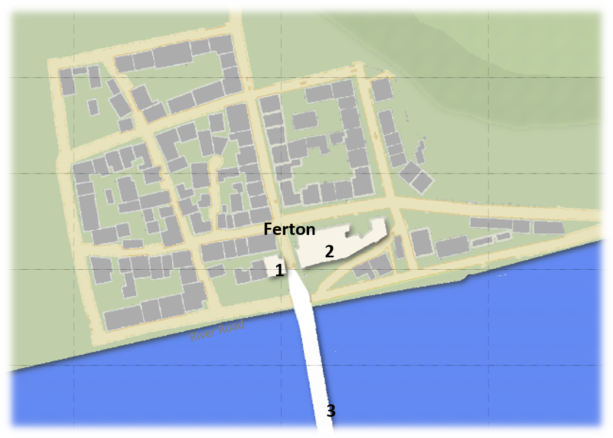
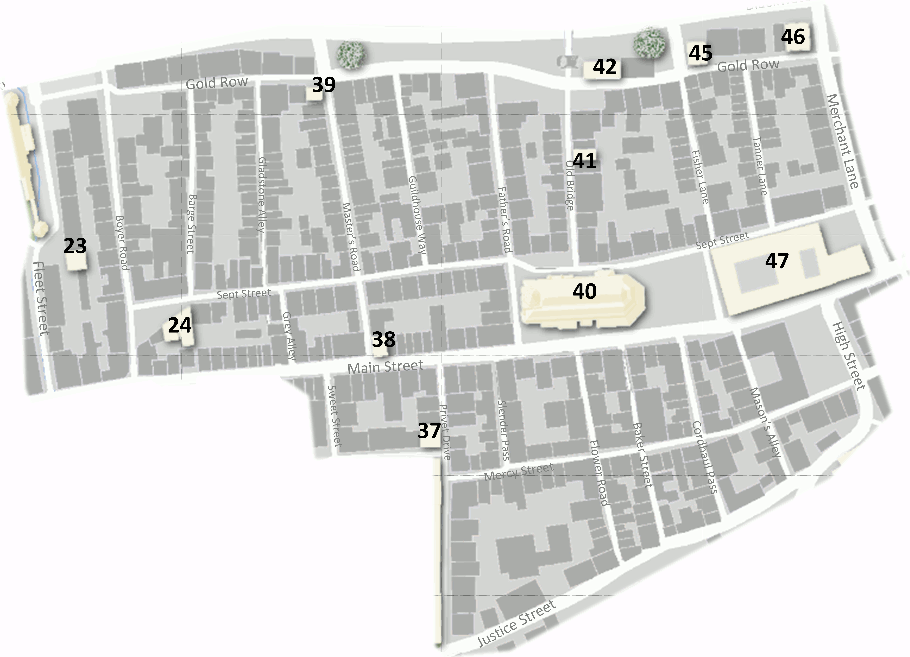
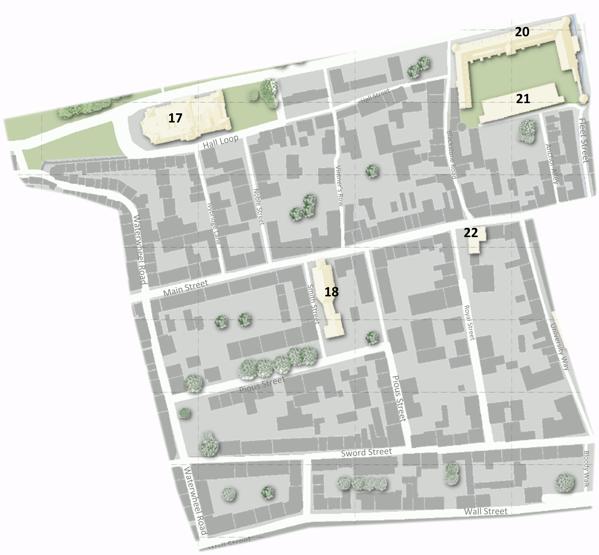
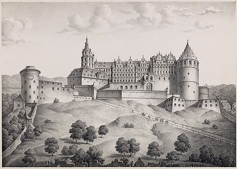

# The City of Blackwater   

UNDER CONSTRUCTION  

The [City of Blackwater](https://rickosborne.github.io/blackwater/guide/050-introduction.html) is informally divided into a number of disctricts or sections:
* [Ferton](https://rickosborne.github.io/blackwater/guide/105-blackwater-city.html#ferton)
* [West End and Main Gate](https://rickosborne.github.io/blackwater/guide/105-blackwater-city.html#main-gate-and-the-west-end)
* [Mid Town](https://rickosborne.github.io/blackwater/guide/105-blackwater-city.html#mid-town)
* [Citadel Square](https://rickosborne.github.io/blackwater/guide/105-blackwater-city.html#citadel-square)
* [Old Quarter](https://rickosborne.github.io/blackwater/guide/105-blackwater-city.html#old-warter)
* [Hill Street](https://rickosborne.github.io/blackwater/guide/105-blackwater-city.html#hill-street)
* [The Warfs](https://rickosborne.github.io/blackwater/guide/105-blackwater-city.html#the-warfs)
* [Under-Castle](https://rickosborne.github.io/blackwater/guide/105-blackwater-city.html#under-castle)  
* [The Castle](https://rickosborne.github.io/blackwater/guide/105-blackwater-city.html#the-castle)

  

## Ferton  
{:.float-right}  

Ferton, a collection of shacks, rundown buildings, and storage yards, lies across the river from the city of Blackwater. Originally a ferry landing for people heading north out of the city, Ferton has become the slum of Blackwater, where the city watch turns a blind eye.  There are a number of homes, and  businesses in Ferton including: the Loggers Union, The Giant Halfling Smokehouse, Red Goat Tallow Shop, Griswold Millhouse, and Millastre's Glass Blowers.  

### Garrison  
A city Watch garrison (#1) was established in Ferton three years ago, but hasn't done much to change the reputation of the enclave.  The garrison is typically less than a dozen men, and are primarily there to regulate commerce traffic across the bridge.  

There has been debate in the City Council about levying a property tax in Ferton and / or a bridge toll to pay for enhanced policing of the area and fund needed bridge repairs.  

### Cock & Balls Inn  
  

The Cock and Balls Inn (#2) is a large 2 story (plus a walkout basement) structure on the East side of the Grand Bridge in Ferton.  It is the primary location for lodging on the north side of the Blackwater, as well as a favorite meeting location for folks wishing to conduct business outside of Blackwater's watchful eyes.  The Inn has dozens of sleeping rooms of varying sizes and sleeping configurations, as well as private meeting and dinning rooms.  

The Inn has a well appointed bar with an impressive selection of Shanaran and Plamarise wines, Blackwater beers, Belorum ales, and Northunder meades.  The kitchen is known for humble, but reliable and filling fare.  The staff is known for both their discretion and their lack of discretion (for the right price).  Even thought the Watch has established a garrison just across the street, they seem to be miles away, and rarely come into the Inn except in off-duty capacity.

## Main Gate and the West End 

### Main Gate (#4)  
The main gate to Blackwater faces roughly west along the slow southernly bend of the Blackwater river, looking out across fields and forests to the snow-capped Carpathian mountains in the distance.  The gate is typically manned by a dozen guards monitoring people coming and going in the City.  The wall is roughly 10 yards thick and the main gate tunnel has a strong steel portcullis at both ends.  In addition to the dozen guards that man the main gate entrance tunnel, another dozen man the towers and battlements  atop walls.

Off to the side of the gate, on the outside of the city, is a station where they:  
* Verify licenses for horses, wagons, and weapons
* Inspect possible enchanted items
* Question any suspiciouos looking travellers
* Peacebond weapons

### West End  
The West End is generally considered to be the area within the walls between the **Main Gate** and **Waterwheel Road**.  The West End tends to be a relatively affluent section of town with a number of quality merchants located in the area, well maintained buildings.  

{:.center}   

A number of well known estalbishments can be found in the West End, including:  
* Duglass Ferrier (#5, C8)  
* Dancing Pony Stables (#6, C8)  
* Yellow Kraken Bath House (#7, D8)   
* Mad Cow Leatherworks (#8, D10)   
* Everfull Cornucopia Tools & Supply (#9, C11)  
* Crone's Sept (#10, D13)  
* Bazaar – Indoor Shops & Stalls (#11, E11)  
* Maiden's Sept & Orphanage (#12, E11)   
* Angry Beaver Furrier (#13, F13)   
* Cow Gate (#14, F13)  
* Black Dragon Gambling House (#15, E8)  
* Golden Noose Comfort House (#16, E7)  
  

#### Douglas Ferrier (#5)  

#### Everfull Cornicopia (#9)

Located just inside the main gate is are a cluster of shops and apartments.  The best known of these shops is the **Everfull Cornicopia** located immediately to the right, on the south side of the main strett, as visitors come through the main gate.  

## The Old Quarter

The Old Quarter is, as the name implies, the oldest section of Blackwater.  The buildings tend to be smaller and more cramped together than in the rest of the city.  The poorest residents of Blackwater tend to live in this district.  

The boundaries of the Old Quarter are somewhat irregular, defined in the West by a path along **Fleet Street** south to **Main Street**, then West to **Sweet Street** and along **Mother's Way** to **Privet Drive**.  The southern edge of The Old Quarter follows **Justive Street** to **High Street** and back to **Main Street**.  The distrect ends along Merchant Lane in the East and **Blackwater Ave** / **The Warfs** in the North.

{:.center}

The Old Quarter contains a number of noteable Blackwater locations:
* White Mallard Public House (#24, I6)
* Happy Hag Apothocary (#37, J7)
* Naked Sheep Tailor (#38, J6)
* Black Lock Money Changer (#39, J4)
* Father's Sept (#40, K6)
* Blue Star Alchemy (#41, K6)
* Skeleton Key Books and Maps (#42, K4)
* Old Bridge (#43, K3)
* Merchant Docks (#44, L3)
* Broach and Pendant (#45, K4)
* Grinning Cat Curiosities (#46, L3)
* Sanctum Magorum (#47, L6)

## Mid-Town
{:.center}  

Mid-Town covers the area of Blackwater from the River to the southern wall and between **Waterwheel Road** and either **Blackstone** road or **Fleet Street**, depending on who you askm to the north of **Main Street**, and **University Way**,.  Mid-town tends to be a fairly quiet residential area, whith the only businesses being mainly clustered along **Main Street**.

Notable businesses and locations in **Mid-Town** include:  
* Assembly Hall (#17, F6)
* Smith's Sept (#18, G8)
* Fleet Headquarters and Barracks (#20, H5-I5)
* Fleet Armory (#21, H6-I6)
* Sore Thumb Tavern & Inn (#22, H8)
* Gozer’s Lock & Key (#23, I5)

## Citadel Sqaure 

## Hill Street

## The Warfs

## Under-Castle

## The Castle
  

# Numerical Index of Key Map Locations
1. Ferton Watch Garrison (B4)
2. Cock & Balls Inn (C4)
3. Grand Bridge (C6)
4. Main Gate (C11)
5. Duglass Ferrier (C8)
6. Dancing Pony Stables (C8)
7. Yellow Kraken Bath House (D8) 
8. Mad Cow Leatherworks (D10) 
9. Everfull Cornucopia Tools & Supply (C11)
10. Crone's Sept (D13)
11. Bazaar – Indoor Shops & Stalls (E11)
12. Maiden's Sept & Orphanage (E11) 
13. Angry Beaver Furrier (F13) 
14. Cow Gate (F13)
15. Black Dragon Gambling House (E8)
16. Golden Noose Comfort House (E7)
17. Assembly Hall (F6)
18. Smith's Sept (G8)
19. Fleet Docks (H4-I4)
20. Fleet Headquarters and Barracks (H5-I5)
21. Fleet Armory (H6-I6)
22. Sore Thumb Tavern & Inn (H8)
23. Gozer’s Lock & Key (I5)
24. White Mallard Public House (I6)
25. Silver Anvil Arms and Armor (I7)
26. Rose and Crown Inn (I7)
27. Black Swan Company Theater House (I9)
28. Blackwater University (I9)
29. Warriors Sept (I11)
30. Watch Barracks (J10)
31. Watch Citadel (J9)
32. Watch Armory (J19)
33. Palace of Justice (J10)
34. Harmonious House (K10)
35. City Jail (K10)
36. Mother’s Sept & Healing House (J8)
37. Happy Hag Apothocary (J7)
38. Naked Sheep Tailor (J6)
39. Black Lock Money Changer (J4)
40. Father's Sept (K6)
41. Blue Star Alchemy (K6)
42. Skeleton Key Books and Maps (K4)
43. Old Bridge (K3)
44. Merchant Docks (L3)
45. Broach and Pendant (K4)
46. Grinning Cat Curiosities (L3)
47. Sanctum Magorum (L6)
48. Blackwater City Administration (L8)
49. Fat Pheasant Boyer & Fletcher (L9)
50. Falling Star Magic and Mysteries (M8)
51. Steep Gate (L10)
52. Stranger's Sept (L12)
53. King's Gate (N11)
54. Castle Blackwater (N9)
55. Earl’s Enchanted Gardens (O9)
56. Floating Castle Lodging and Drink (M7)
57. Hammer and Sword Smithing (M6)
58. Flying Saddle Stables & Ferrier (N3)
59. Statue of The Seven (O3)
60. Father's Gate (O2)

# Alphabetical Index of Key Map Locations  

-	Angry Beaver Furrier (F13)	
-	Assembly Hall (F6)
-	Bazaar – Indoor Shops & Stalls (E11)
-	Black Dragon Gambling House (E8)
-	Black Lock Money Changer (J4)
-	Black Swan Company Theater House (I9)
-	Blackwater City Administration (L8)
-	Blackwater University (I9)
-	Blue Star Alchemy (K6)
-	Broach and Pendant (K4)
-	Castle Blackwater (N9)
-	City Jail (K10)
-	Cock & Balls Inn (C4)
-	Cow Gate (F13)
-	Crone's Sept (D13)
-	Dancing Pony Stables (C8)
-	Duglass Ferrier (C8)
-	Earl’s Enchanted Gardens (O9)
-	Everfull Cornucopia Tools & Supply (C11)
-	Falling Star Magic and Mysteries (M8)
-	Fat Pheasant Boyer & Fletcher (L9)
-	Father's Gate (O2)
-	Father's Sept (K6)
-	Ferton Watch Garrison (B4)
-	Fleet Armory (H6-I6)
-	Fleet Docks (H4-I4)
-	Fleet Headquarters and Barracks (H5-I5)
-	Floating Castle Lodging and Drink (M7)
-	Flying Saddle Stables & Ferrier (N3)
-	Golden Noose Comfort House (E7)
-	Gozer’s Lock & Key (I5)
-	Grand Bridge (C6)
-	Grinning Cat Curiosities (L3)
-	Hammer and Sword Smithing (M6)
-	Happy Hag Apothocary (J7)
-	Harmonious House (K10)
-	King's Gate (N11)
-	Mad Cow Leatherworks (D10) 
-	Maiden's Sept & Orphanage (E11) 
-	Main Gate (C11)
-	Merchant Docks (L3)
-	Mother’s Sept & Healing House (J8)
-	Naked Sheep Tailor (J6)
-	Old Bridge (K3)
-	Palace of Justice (J10)
-	Rose and Crown Inn (I7)
-	Sanctum Magorum (L6)
-	Silver Anvil Arms and Armor (I7)
-	Skeleton Key Books and Maps (K4)
-	Smith's Sept (G8)
-	Sore Thumb Tavern & Inn (H8)
-	Statue of The Seven (O3)
-	Steep Gate (L10)
-	Stranger's Sept (L12)
-	Warriors Sept (I11)
-	Watch Armory (J19)
-	Watch Barracks (J10)
-	Watch Citadel (J9)
-	White Mallard Public House (I6)
-	Yellow Kraken Bath House (D8)	

