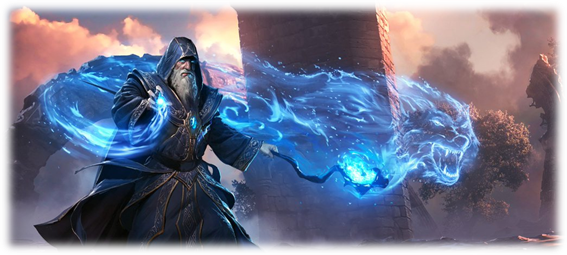

# Magic

Magic is known but uncommon in and around Blackwater.  Magic works as described in the [GURPS Magic](https://www.sjgames.com/gurps/books/magic/) source book. Most residents of Blackwater can count on one hand the number of times they’ve seen true magic done.  As a result, there is a fair bit of superstition, misunderstanding, and misperceptions about mages among the general population.  

## Order of the Magi

The roughly 300 Mages known to live in Blackwater banded together over a century ago to form the Order of the Magi.  The Order serves 3 primary purposes: 
1.	Mutual protection of mages from suspicious and distrustful non-mages, especially the Faith of the Seven.  
2.	Education and exchange of magical knowledge among its members.  
3.	Regulation and policing of magical practices in and around Blackwater, particularly to prevent unwanted backlash from non-magical people.  

The Order requires all magically active people, with the exception of Elves, to submit to examination and usually training from the Order.  Members of the Order routinely survey adolescent age children searching for expression of magical talent that commonly manifests during puberty.  Trained and experienced mages outside Blackwater are put through an examination and graded based on their knowledge and ability.  Any refusing Order membership are declared renegades.  

The order ranks its members based on their magical ability and assigns color coded robes for each rank.  The exact style of the robes is up to the individual mage; however, 3 basic styles are the most common: cassock / soutane, surcoat, or a hooded robe.  At each ascension ceremony marking the transition to the next rank, the mage is permanently Mystic Marked (M.119) by the presiding Magi, so that even when out of his robes, other mages will be able to tell his Order membership and rank.  Failing to wear appropriate robes when in public, or at Order functions, is frowned upon and scrutinized, but not, technically, against any rules of the order.  

{:.float-right}

Magi Ranks & Robes

* Neophyte - Red  
* Initiate - Orange  
* Novice - Yellow  
* Disciple - Green  
* Adept - Blue  
* Maven - Purple  
* Enchanter - Grey  
* Magi - Black   
  
There is an additional rank of Arch-Magi that is elected from among the Magi to serve as the magical advisor to the Earl of Blackwater.
Initiates, Novices, and Disciples are commonly apprentices to Adepts, Mavens, and Enchanters, although these relationships are subtle, subjective and determined largely on a case-by-case basis by the personalities involved.  

Members of the Order also wear symbols on their robes signifying each college that they have mastered.  Mastering a given college means that the mage can cast at least 10 spells from that college and can cast at least 3 of those spells can be cast with no ritual (at level 20).  “Grand Master” is a title reserved for a mage that has mastered at least 10 colleges of Magic.  Being a Master of a college, or being a Grand Master, is different from the Ranks of the members of the order.  For example, a mage might only be an Adept member of the Order but could also be a Master of the Water College.  There are currently no Grand Masters, and only a few Masters within the Order.  

Being a member of the Order of the Magi has both benefits and drawbacks.  It costs 10 points to be a member of the Order.  

**Order of the Magi Character Template [10 Points]**  
Advantages [+15]: Magery 0 [+5], Patron [+10] (fairly often - 9 or less x1)  
Disadvantages [-5]: Duty (fairly often, 9 or less) [-5]

## Renegade Mages
Mages who live in the City of Blackwater or the surrounding area and refuse to join the Order, or remain hidden from the Order, live as renegade mages.  They must operate in secret and hide from members of the Order.  Being a renegade mage is illegal under Blackwater law, and those caught and convicted, are turned over to the order to be “Gentled” - have their magical talent permanently removed.    

It costs -15 points to be a renegade mage.  

**Renegade Mage Character Template [-15 points]**  
Advantages [+5]: Magery 0 [+5]  
Disadvantages [-20]: Secret (Renegade Mage) [-20]
