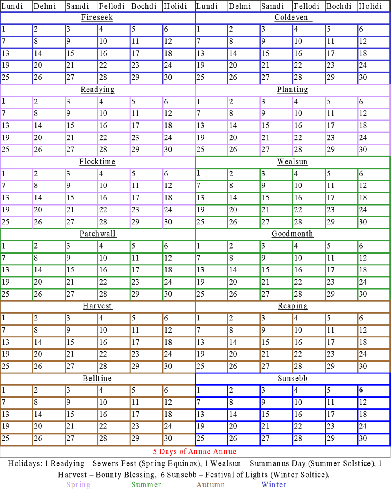

<table>
  <tr><td><b>Navigation</b></td></tr>
  <tr><td>

  <a href="{{ chapter.url | relative_url }}">{{ chapter.title }}</a> 
  
    </td></tr></table>  

# Calendar  	

## Epoch
The Heliconian calendar still used in Blackwater, counts the years from the founding of Heliconia, over 850 years ago.  Most of the cities that were once part of the Helic empire still use the calendar.  Years are noted as Annae Pax Heliconium (APH) after the founding of the imperial city, or Annae Anti Heliconium (AAH) for years preceding the founding.  

## History  
The Heliconian calendar was created over three hundred years ago by the Herstotile Brothers. The Brothers are a religious order that founded the Ordinal Cathedral in the ancient city of Heliconium. The calendar dates from the fall of Heliconian at the end of the Grokim Wars. The calendar contains 365 days, divided into 12 months. Each month contains 30 days, divided into 5 weeks of 6 days each.   

The months are: 
- Fireseek  
- Coldeven  
- Readying  
- Planting  
- Flocktime  
- Wealsun  
- Reaping  
- Goodmonth  
- Harvest  
- Patchwall  
- Belltine  
- Sunsebb  

The days of the week are:  
- Lundi  
- Delmi  
- Samdi  
- Fellodi  
- Bochdi  
- Holidi 

Holidi is the typical day of worship and rest.   

  

## Holidays  
The Largest and most popular Holiday is Annae Annue. It’s the celebration of the New Year. Traditional celebrations include many feasts, family gatherings, the exchanging of gifts and the worship of the gods.  It is universally regarded as a time of peace and friendship, and only the most despicable and heinous of fiends would do violence or cause harm during the season.  

  

# Common Knowledge History Timeline  
•	**~200 AAH**: Establishment of village of Blackwater by Humans under protection of Clan Belor   
•	**~100 AAH**: Founding of the Tower of High Sorcery by the Arch-Mage Raistilin.   
•	**0 APH**: Founding of the Imperial City of Heliconium. Previously known as Helica. Adoption of the Faith of the Seven as the official religion of Heliconium  
•	**112 APH**: Establishment of Imperial Garrison at Negronium (renamed from Blackwater). Previously and ferry dock for boats working upriver and down to ships docked in the Covari  
•	**484 - 496**: The Troubles – a time of great unrest across Heliconium under the despotic rule of Empress Tatiana  
..•	484: Empress Tatiana accedes to throne after no male heirs are able to establish a claim  
..•	485: Empress Tatiana orders a purge of all non-humans and “unnatural” beings from the Empire  
..•	485-492: Strig Onslaught against Tarasia in 485, 489, and 2 year siege 491-492  
..•	487: Lord General Abingdon is tried and executed for attempting to assassinate the Empress with his Dark Elf mistress, Ethedra  
..•	487 – 496: Triggered by the arrest the Drow incursions begin and Mallium provides aid to Heliconium  
..•	489 – 496: Magewar rebellion:  A group called the Magi rebelled against the Tower of High Sorcery and its loyalty to the Empress  
...o	494: Battle of Three Rivers south of Heliconium - Magi lost.  Imperial forces and Tower of High Sorcery won  
...o	496: Magi fled from the Tower and Heliconium as a result  
..•	493: Plamar issues Declaration of Secession from the Empire and the founding of the Plamarise League  
..•	495: T’skrang (Lizard Men) sack Vasiliki  
..•	496: “Fall” of the Helic Empire: The Grand Septa of Heliconium declared the Tower, all Magical works and the Empress Tatiana as Anathema.  Tens of thousands of faithful rallied to his call and sacked the Imperial palace and the Tower leading to the physical and figurative destruction of the Tower of High Sorcery, along with years of inward contraction by the remnants of the Empire  
•	**666 - 669**: Blackwater Succession Wars triggered when deposed Queen Miranda assassinated her husband and stepson and claimed the throne.  Various factions battled across the city and surrounding countryside trading off control of the city  
•	**669**: The Revelation - Mages who had been living in secret among the people of Blackwater emerged into public and battled on the side of the of Seven defeating Queen Miranda’s forces permanently    
•	**670**: First free election of Earl (Rostand) and renaming of the City to Blackwater.  Establishment of the Council of Blackwater  
•	**678**: Establishment of the Order of the Magi in Blackwater  
•	**776**: Free Mage Riots in Blackwater: Magical duels in the streets killed innocent by standers and set fire to several buildings in the docks, in addition to a persistent presence of charlatans claiming magical healing led to repeated riots in the city and ultimately City   
•	**777**: Decree of Gentling  
o	Signed by the Order, the City Council and the Earl - Any non-guild mage caught practicing mage will be “Gentled” - have their Magical abilities permanently removed by the order in a magical ceremony.  
•	**852**: Current day Blackwater  

