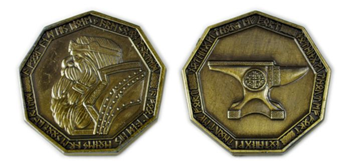

# Money

The city of Blackwater mints its own coinage and currency, however, coinage from Plamar and Belor are also readily taken at commonly accepted exchange rates.  

|CITY/STATE|COIN|METAL|VALUE|COINS / LB|  
|---|---|---|---|---|
|BELOR|Doh|Copper|$1|80|
|BELOR|Laet|Copper|$5|16|
|BELOR|Ulet|Copper|$10|8|
|BELOR|Bejik|Silver|$20|20|
|BELOR|Sudik|Silver|45|10|
|BELOR|Tebok|Gold|$150|36|
|BELOR|Nebok|Gold|$380|15|
|BELOR|Shilobok|Platinum|$1100|25|
|BELOR|Neribok|Platinum|1720|16|
|BLACKWATER|Penny|Copper|$1|80|
|BLACKWATER|Farthing|Copper|$4|20|
|BLACKWATER|Mark|Copper|$8|10|
|BLACKWATER|Talent|Silver|$25|16|
|BLACKWATER|Royal|Gold|$140|36|
|PLAMAR|Chit|Copper$1|80|
|PLAMAR|Boor|Copper|6|16|
|PLAMAR|Crest|Silver|$30|14|
|PLAMAR|Cown|Gold|$250|20|
|PLAMAR|Sigil|Gold|$500|10|

{:.float-center}

